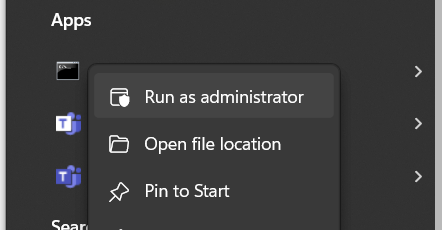
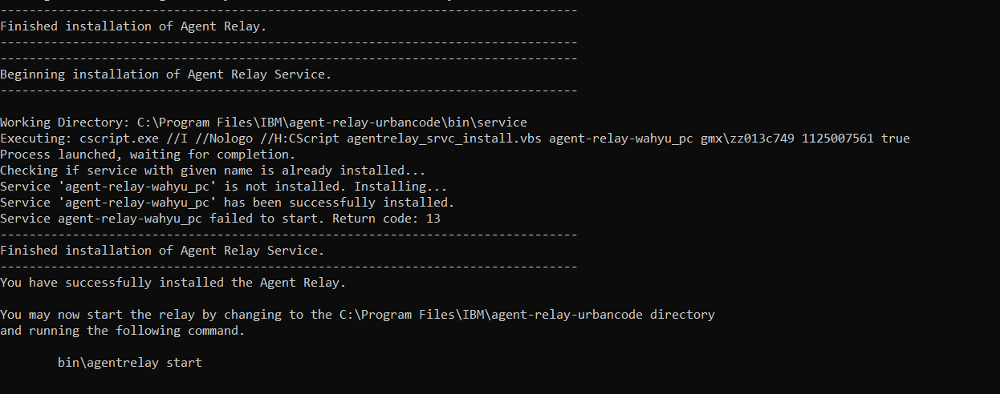
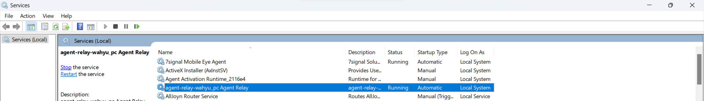

# Installasi IBM Urban Code Agent-Relay

## Prerequisite
1. IBM Urban Code Server yang telah terinstall
2. OS Windows

## Langkah Installasi
1. Download agent-relay di [temporary-link](https://cdn.mig.id/tititp/agent-relay.zip)
2. Extract file *agent-relay.zip*
3. Buka terminal dan login as administrator

4. Pada terminal, pindah ke directory tempat lokasi agent-relay di extract.
```
    cd PATH_EXTRACTED_AGENT_RELAY/agent-relay-install/
```
5. Cari file install dengan tipe **Windows Command Script**. Eksekusi file tersebut di dalam terminal
```
    install.cmd
```
6. Saat proses installasi, akan ada beberapa konfigurasi yang perlu di atur. Untuk mengambil nilai default, cukup tekan tombol **enter** tanpa memasukkan value apa pun. Berikut beberapa Pengaturan yang perlu di konfigurasi:
    
    - *Enter the home directory for the JRE/JDK that the relay should use. Default []:*\
        lokasi directory tempat installasi Java. 
        Contoh: **C:\Program Files\IBM\MQ\java\jre** 
    - *The specified directory does not exist. Do you want to create it?:*\
        isi dengan **Y**
    - *Enter a unique name for this relay.*\
        Dapat di isi dengan value bebas. 
        Contoh: **agent-relay-wahyu_pc** 
    - *Enter the port number that this Agent Relay listens for proxy HTTP requests on.:[20080]*\
        Konfigurasi bahwa agent-relay akan listen di Port **20080**
    - *Enter the web agent communication URL for your UrbanCode Deploy server. It must begin with 'wss://'.:[Default: wss://localhost:7919]*\
        Pada bagian ini ganti localhost dengan ip tempat UrbanCode Server di-install (**wss://192.168.175.115:7919**)
    - *Do you want to configure another failover server connection? [Default: false]:*\
        Pada bagian ini set ke **No/false**.
    - *Enable the agent relay to verify the server HTTPS certificate?
    If enabled, you must import the server certificate to the JRE keystore on the agent relay.:*\
        Pada bagian ini set ke **No/false**.
    - *Enter the full web UI URL for the central server. (Example: https://ucd.example.org:8443)]*\
    Pada bagian ini web UI merujuk pada lokasi UrbanCode Server. (**http://192.168.175.115:9000**) 
    - The relay supports caching artifacts downloaded by agents using this relay. This
    is useful in reducing the bandwidth usage on the central server during large
    deployments, and is recommended for configurations involving thousands of agents.
    Do you want to cache files on the relay that are downloaded by connected agents?:
    [y/N]\
    Pada bagian ini set ke **No/false**.
    - *Do you want to install the Agent Relay as Windows service?:*\
    Pada bagian ini set ke **Yes/true**. Pada bagian ini agent relay akan aktif sebagai Windows Service.
    - *Enter a unique service name for the Agent Relay. No spaces please.*\
    Kita set nama sama seperti unique name pada agent relay **agent-relay-wahyu_pc**
    - *Enter the user account name including domain path to run the service as (for local use '.\' before login).[.\localsystem]*\
    kita pakai nilai default dari **.\localsystem**

6. Tunggu hingga Proses installasi selesai 


7. Anda dapat mengeceknya di menu **Services** di Windows



#


## Troubleshooting
Untuk melakukan Troubleshooting di UrbanCode Agent-Relay. Anda dapat melakukannya dengan mengecek log nya.
```
    PATH_INSTALLED_AGENT_RELAY/var/logs/jms-relay.log
``` 

Path Installasi adalah path yang anda definisikan saat pertama kali install agent-relay.

## Notes
1. Pastikan firewall di non-aktif kan
2. Pastikan Port untuk **wss** UrbanCode Server di *allow*. Pada kasus ini kami menggunakan port **7919**
3. Pastikan port untuk listen http agent-relay di *allow*. Pada kasus ini **20080**.
4. Ketika mengganti configurasi, pastikan melakukan restart server untuk men-refresh aplikasi **agent-relay**

Beberapa teknik yang perlu diketahui:
1. [Menyalakan agent-relay secara manual](troubleshooting/Manual%20Start%20Agent%20Relay.md)