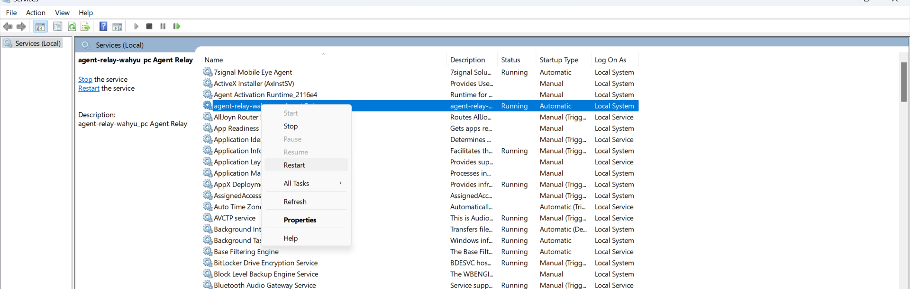

# Langkah manual untuk IBM Urban Code Agent-Relay

Ketika menyalakan UrbanCode agent-relay anda dapat menggunakan binary pada forlder tempat instal di 

```
    PATH_INSTALLED_AGENT_RELAY/bin/agentrelay start
```

pada **windows**, anda akan dapat melihat agent-relay berjalan di menu service. Apabila masih belum berjalan, anda dapat menjalankan secara manual.
